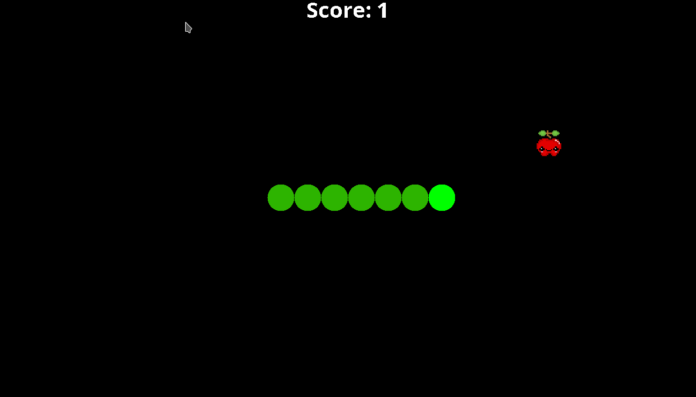

# Snake Game

This is a recreation of the classic snake game. You can use the ↑, ↓, → and ← arrows to move the snake.

Technologies used:
- Java Swing
- Java AWT

## How to launch the game

1. Make sure you have Java JDK installed.
2. Clone the code: https://github.com/georgia-koukoutou/snake-game.git
3. Open the game directory with `cd snake-game`.
4. Compile the game with `mvn clean package`.
4. Run the game using `java -jar target/snake.jar `.
3. Enjoy the game!

## Game demo

